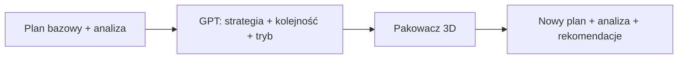

# TrackLoadSim — instrukcja użytkownika

Kompletny przewodnik po aplikacji: instalacja, interfejs, optymalizacja ładunku, AI, analiza bezpieczeństwa i eksport.

---

## 1. Czym jest TrackLoadSim?

TrackLoadSim to narzędzie do **planowania załadunku** towaru luzem (kartony, moduły) w naczepie:

- wizualizacja **3D** układu w skrzyni naczepy,
- **automatyczne pakowanie** (heurystyka 3D) i opcjonalnie **sugestie GPT**,
- **metryki** (masa, objętość, LDM, środek masy, osie),
- **analiza bezpieczeństwa** (przesunięcia przy hamowaniu / zakrętach, przewrót),
- **rekomendacje** załadunku i jazdy,
- **eksport** planu (JSON) i **mapy załadunku** (PDF),
- **import** listy towaru z Excel / CSV.

> Model fizyczny i rekomendacje mają charakter **pomocniczy** — nie zastępują przepisów, homologacji ani ważenia osi.

---

## 2. Wymagania i instalacja

### 2.1 Oprogramowanie

| Komponent | Wersja |
|-----------|--------|
| Python | 3.11+ |
| Node.js | 18+ |
| Przeglądarka | Chrome, Edge, Firefox (aktualna) |

Opcjonalnie:

- **PyBullet** — test stabilności po optymalizacji,
- **OpenAI API** — optymalizacja wspomagana GPT.

### 2.2 Backend (port 8001)

```bash
cd backend
python -m venv .venv
.venv\Scripts\activate          # Windows
# source .venv/bin/activate     # Linux / macOS
pip install -r requirements.txt
uvicorn app.main:app --reload --port 8001
```

Sprawdzenie: [http://127.0.0.1:8001/api/health](http://127.0.0.1:8001/api/health) → `{"status":"ok"}`.

**PyBullet (opcjonalnie):**

```bash
pip install -r requirements-physics.txt
```

**OpenAI (opcjonalnie — optymalizacja AI):**

Ustaw zmienną środowiskową przed uruchomieniem serwera:

```bash
# Windows PowerShell
$env:OPENAI_API_KEY = "sk-..."
# opcjonalnie inny model / proxy
$env:OPENAI_MODEL = "gpt-4o-mini"
$env:OPENAI_BASE_URL = "https://api.openai.com/v1"
```

Możesz też podać klucz w panelu AI w przeglądarce (zapis lokalny w `localStorage`).

### 2.3 Frontend (port 5173)

```bash
cd frontend
npm install
npm run dev
```

Aplikacja: [http://localhost:5173](http://localhost:5173).

Żądania `/api/*` są przekierowywane do backendu (`frontend/vite.config.ts`).

---

## 3. Układ ekranu

```
┌─────────────────┬──────────────────────────┬─────────────────────┐
│  Lista ładunku  │   Widok 3D naczepy       │  Panel boczny       │
│  (produkty)     │   (obracanie, zoom)      │  scenariusz, AI,    │
│                 │                          │  rekomendacje,      │
│                 │                          │  metryki, analiza,  │
│                 │                          │  przyciski akcji    │
└─────────────────┴──────────────────────────┴─────────────────────┘
```

### 3.1 Widok 3D

- **Obrót / zoom** — mysz (OrbitControls).
- **Kliknięcie skrzynki** — szczegóły po prawej (wymiary, pozycja, kolejność załadunku).
- **Przezroczysta skrzynia** — widać wnętrze i układ.
- **Widok „exploded”** — rozsuwa skrzynki dla czytelności.
- Oznaczenia **PRZÓD / TYŁ / LEWA / PRAWA** na podłodze naczepy.
- **Środek masy** — różowy marker (szacunek geometryczny).

Układ współrzędnych w danych: **x** = długość naczepy (0 = przód), **y** = szerokość, **z** = wysokość od podłogi.

### 3.2 Panel boczny (od góry)

| Sekcja | Opis |
|--------|------|
| Scenariusz | Wybór demo S1–S6 lub import |
| Naczepa | Wymiary i limity |
| Optymalizacja AI | GPT — strategia i układ |
| Podsumowanie / rekomendacje | Status operacyjny, załadunek, jazda |
| Ładunek — podsumowanie | Masa, objętość, LDM, warstwy, osie |
| Analiza bezpieczeństwa | Ryzyka, prędkości, przewrót |
| Wybrana skrzynka | Po kliknięciu w 3D |
| Ostrzeżenia planu | Z pakowacza / AI / fizyki |
| Przyciski | Przelicz, stosy, PDF, JSON, import |

---

## 4. Typowy workflow

### Krok 1 — Wybierz scenariusz lub importuj dane

- Z listy **Scenariusz** wybierz np. `S1_HALF_LOADED` (połowa podłogi) lub `S2_OPTIMIZED` (2 warstwy).
- Albo **Import .xlsx / .csv** — kolumny m.in. nazwa, wymiary mm, waga, ilość, fragile.

### Krok 2 — Przelicz rozmieszczenie

Przycisk **„Przelicz rozmieszczenie”**:

- buduje plan **od zera** z kolumny **szt** w tabeli ładunku,
- tryb **greedy** — wypełnianie przestrzeni od podłogi,
- opcjonalnie **PyBullet** (checkbox) — test stabilności.

### Krok 3 — Układ pionowy (stosy)

**„Optymalizuj układ (stosy)”** — tryb **stacked**:

- preferuje **kolumny** na istniejącym ładunku,
- cięższe sztuki wcześniej w kolejności,
- lepsze wykorzystanie **wysokości** naczepy.

### Krok 4 — Optymalizacja AI (opcjonalnie)

1. **Zweryfikuj połączenie AI** — status zielony = OK.
2. Wpisz **uwagi** (np. „kruche na podłodze”, „A pod B”, „maks. 2 warstwy”).
3. **Optymalizuj z AI**.

Efekt:

- nowy układ 3D,
- tekst **Strategia** pod panelem AI,
- odświeżone **Podsumowanie** i **Rekomendacje** (analiza na nowym planie),
- wskazówki AI na liście rekomendacji załadunku.

### Krok 5 — Analiza i eksport

- Przejrzyj **Analizę bezpieczeństwa** i kliknij ryzykowne jednostki (podświetlenie w 3D).
- **Mapa załadunku (PDF)** — rzut z góry, warstwy, kolejność.
- **Eksport JSON** — pełny plan do integracji.

---

## 5. Optymalizacja AI — jak to działa



1. Backend liczy plan bazowy (lub bierze bieżący z UI).
2. Uruchamiana jest **analiza bezpieczeństwa** — notatki trafiają do promptu GPT.
3. Model zwraca JSON: `pack_mode`, `load_order`, `strategy_summary`, `loading_tips`.
4. **Pakowacz** układa skrzynki według kolejności i trybu.
5. Ponowna **analiza** na nowym planie → panel rekomendacji.

### Tryby pakowania

| `pack_mode` | Zachowanie |
|-------------|------------|
| `greedy` | Preferuje podłogę (z≈0), rozłożenie w XY |
| `stacked` | Preferuje stosy, piętrowanie przy podparciu |

Jeśli GPT opisuje **warstwy**, a w JSON jest `greedy`, backend **wymusza** `stacked` (dopasowanie tekstu do trybu).

### Strategia vs rzeczywisty układ

- **Strategia** — opis językowy od GPT (może być ogólny).
- **Widok 3D** — wynik pakowacza (twarde reguły: kolizje, podparcie, wysokość).
- W **Ładunek — podsumowanie** pole **„Warstwy (pionowo)”** pokazuje faktyczną liczbę poziomów z.

Jeśli strategia mówi o warstwach, a **Warstwy = 1**, sprawdź ostrzeżenia planu lub użyj **„Optymalizuj układ (stosy)”**.

### Konfiguracja klucza API

| Sposób | Gdzie |
|--------|--------|
| Zmienna `OPENAI_API_KEY` | Serwer backend (zalecane produkcyjnie) |
| Pole w panelu AI | Przeglądarka (`localStorage`) |

Model domyślny: `gpt-4o-mini` (`OPENAI_MODEL`).

---

## 6. Rekomendacje i podsumowanie

Generowane przez `/api/analyze` (oraz od razu po AI w odpowiedzi `/api/ai/optimize`).

### Podsumowanie

- status: **OK** / **UWAGA** / **STOP**,
- akapit operacyjny,
- **werdykt** (czy można jechać wg modelu),
- metryki kluczowe.

### Rekomendacja załadunku

- masa, wykorzystanie objętości, środek masy,
- liczba warstw, ryzyka opakowań, sufity,
- ostrzeżenia z planu i wskazówki AI.

### Rekomendacja jazdy

- przewrót (uproszczony model),
- bezpieczna prędkość referencyjna wg scenariuszy 50 / 80 / 90 km/h,
- mocowanie przy wysokim ryzyku.

Po każdej zmianie planu (Przelicz / Stosy / AI) warto **poczekać chwilę** na odświeżenie analizy w panelu.

---

## 7. Scenariusze demonstracyjne

| ID | Zastosowanie |
|----|----------------|
| `S1_HALF_LOADED` | ~50% podłogi, 13×A + 4×B, dużo wolnej wysokości |
| `S2_OPTIMIZED` | Siatka 4×3×2, wysokie wykorzystanie objętości |
| `S3_OVERLOAD` | Ryzyko przeciążenia masy |
| `S4_FRAGILE` | Towary kruche — tylko podłoga / ostrożne piętrowanie |
| `S5_MIXED` | Różne SKU i grupy stosowania |
| `S6_MAX_PACKED` | Maksymalne zagęszczenie, test sufitu |

---

## 8. Własne scenariusze (szablon + import)

Pełna instrukcja: **[SZABLON_SCENARIUSZA.md](./SZABLON_SCENARIUSZA.md)** — pobierz szablon Excel/CSV w panelu bocznym, uzupełnij **Products** (i opcjonalnie **Trailer** w .xlsx), potem **Import**.

Przykładowe kolumny (arkusz Products):

| Kolumna | Opis |
|---------|------|
| ProductId | Kod SKU |
| ProductName | Nazwa |
| LengthMm, WidthMm, HeightMm | Wymiary [mm] |
| WeightKg | Masa [kg] |
| Quantity | Liczba sztuk |
| Fragile | TAK/NIE |
| Compressible | TAK/NIE |
| MaxStackWeightKg | Limit obciążenia stosu |

Po imporcie plan jest liczony automatycznie (greedy).

---

## 9. Eksport

### JSON planu

Zawiera wszystkie `PlacedBox`: pozycje, wymiary po obrocie, `load_order`, flagi.

### PDF — mapa załadunku

- rzut z góry (XY),
- oznaczenia warstw (W1, W2…), kolumny ×k,
- legenda i metadane scenariusza.

Wymaga wcześniejszego przeliczenia planu (niepusty `boxes`).

---

## 10. Rozwiązywanie problemów

| Problem | Rozwiązanie |
|---------|-------------|
| Frontend bez danych | Uruchom backend na **8001** |
| `503` przy AI | Ustaw klucz OpenAI, kliknij **Zweryfikuj połączenie** |
| Rekomendacje „bez zmian” | Porównaj metryki; przy podobnym układzie teksty są podobne — sprawdź **Warstwy** i ostrzeżenia |
| AI: warstwy w tekście, 1 warstwa w 3D | Użyj **stosy** lub uwag „stacked”; sprawdź wysokość i podparcie |
| PyBullet skipped | Zainstaluj `requirements-physics.txt` |
| Nie wszystkie sztuki ułożone | Zmniejsz quantity lub wymiary; komunikat „Ułożono X / Y” |
| CORS / API | Dev: tylko przez Vite proxy lub ten sam host |

Logi backendu: terminal z `uvicorn`. Dokumentacja API: [API.md](./API.md), Swagger: `/docs`.

---

## 11. Dalsza dokumentacja

| Dokument | Zawartość |
|----------|-----------|
| [API.md](./API.md) | Endpointy REST, modele JSON |
| [SZABLON_SCENARIUSZA.md](./SZABLON_SCENARIUSZA.md) | Szablon Excel/CSV i własne scenariusze |
| [AI.md](./AI.md) | Szczegóły integracji OpenAI |
| [PROJECT_SPEC.md](./PROJECT_SPEC.md) | Specyfikacja MVP |
| [../backend/README.md](../backend/README.md) | Struktura backendu |
| [../frontend/README.md](../frontend/README.md) | Struktura frontendu |

---

## 12. Bezpieczeństwo i dane

- Klucz API w przeglądarce trafia do backendu w żądaniu HTTPS (w dev: localhost) — **nie udostępniaj** klucza produkcyjnego publicznie.
- Nie commituj pliku `.env` z kluczami (jest w `.gitignore`).
- Plany i scenariusze demo nie zawierają danych osobowych.
